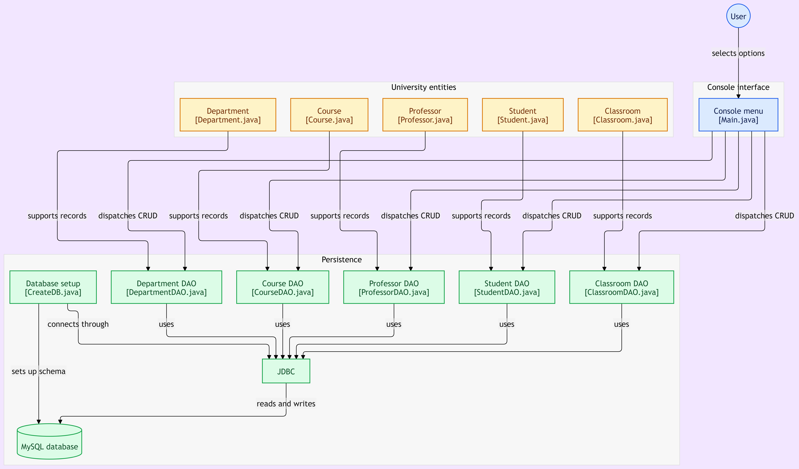

# University Management System

A console-based **University Management System** built using **Java, JDBC, and MySQL**. The application allows users to manage core university entities — Departments, Professors, Courses, Students, and Classrooms — through basic CRUD (Create, Read, Update, Delete) operations via a command-line interface.

The project follows the **DAO (Data Access Object)** design pattern to separate database access logic from application logic.

---

##  Features

- Manage 5 entities: **Department, Professor, Course, Student, Classroom**
- Add, delete, update, and display records for each entity
- Foreign key relationships linking entities to their department
- Auto-increment ID reset when a table becomes empty
- Store all data in a MySQL database via JDBC

---

##  Tech Stack

| Technology     | Purpose                                             |
|----------------|--------------------------------------------------------|
| **Java**       | Application logic and OOP                              |
| **JDBC**       | Database connectivity                                   |
| **MySQL**      | Database management                                     |
| **Maven**      | Dependency and project management                       |
| **DAO Pattern**| Separating database operations from application logic   |

---

##  Project Structure

```
src/main/java/org/example/
├── dao/
│   ├── DepartmentDAO.java
│   ├── ProfessorDAO.java
│   ├── CourseDAO.java
│   ├── StudentDAO.java
│   └── ClassroomDAO.java
├── db/
│   └── CreateDB.java        # Database connection and table setup
├── model/
│   ├── Department.java
│   ├── Professor.java
│   ├── Course.java
│   ├── Student.java
│   └── Classroom.java
└── Main.java                 # Application entry point and console menu
```

### Package Responsibilities

- **`model`** — Entity classes representing university data (Department, Professor, Course, Student, Classroom).
- **`dao`** — One DAO per entity, handling insert, update, delete, and retrieve operations.
- **`db`** — Database connection setup and table creation (`CreateDB.java`).
- **`Main.java`** — Entry point of the application; provides the console-based menu for all entities.

---

##  Database Schema

All entities except `departments` reference `DEPARTMENT_ID` as a foreign key.

| Table         | Key Columns                                              |
|---------------|------------------------------------------------------------|
| `departments` | DID, DNAME, HOD_NAME, BUILDING                             |
| `professors`  | PID, PNAME, EMAIL, SALARY, DEPARTMENT_ID                   |
| `courses`     | CID, CNAME, CREDITS, DEPARTMENT_ID                          |
| `students`    | SID, SNAME, ROLL_NO, EMAIL, DEPARTMENT_ID                   |
| `classrooms`  | RID, ROOM_NUMBER, CAPACITY, DEPARTMENT_ID                   |

```
Java Application → JDBC → MySQL Database
```

---

##  Getting Started

### Prerequisites

- JDK 8 or later
- MySQL
- Maven
- IntelliJ IDEA (or any Java-compatible IDE)

### 1. Clone the repository

```bash
git clone <repo-url>
cd university-management-jdbc
```

### 2. Configure MySQL

Make sure your MySQL server is running, then configure the connection details (URL, username, password) in `CreateDB.java`.


### 3. Install dependencies

```bash
mvn clean install
```

### 4. Run the application

Open the project in your IDE and run `Main.java`, or use:

```bash
mvn compile exec:java -Dexec.mainClass="org.example.Main"
```

---

##  Application Menu

```
Welcome to University Management System

Select Entity: 1-Department 2-Professor 3-Course 4-Student 5-Classroom 6-EXIT
Select Operation: 1-ADD 2-DELETE 3-UPDATE 4-DISPLAY
```

Select an entity first, then choose the operation to perform on it.

---

##  CRUD Operations

Each entity (Department, Professor, Course, Student, Classroom) supports:

| Operation | Description |
|-----------|-------------|
|  Add     | Insert a new record |
|  Display | Show all records for that entity |
|  Update  | Modify an existing record (blank input keeps the current value) |
|  Delete  | Remove a record and reset auto-increment if the table becomes empty |

---

##  Application Architecture



```

Each entity has its own DAO, keeping database logic isolated and the codebase easy to extend.

---

##  Future Improvements

- [ ] Add input validation
- [ ] Add search functionality across entities
- [ ] Improve exception handling
- [ ] Add confirmation before deleting a record
- [ ] Use try-with-resources for JDBC objects
- [ ] Add a GUI using JavaFX or Swing

---

##  Learning Outcomes

Through this project, I practiced and improved my understanding of:

- Java fundamentals & OOP
- JDBC and MySQL database connectivity
- Multi-entity relational database design (foreign keys)
- CRUD operations across multiple related tables
- DAO design pattern
- Maven project management

---

## 👤 Author

**Jaid Mulla**

## 📄 License

This project was created for learning and educational purposes.
